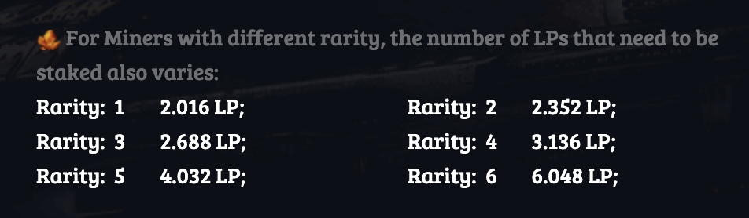
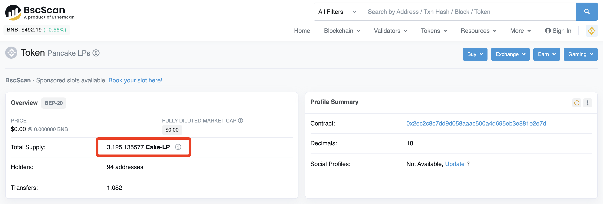
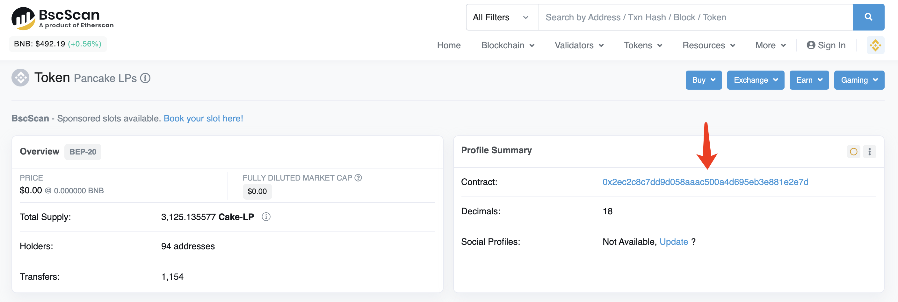
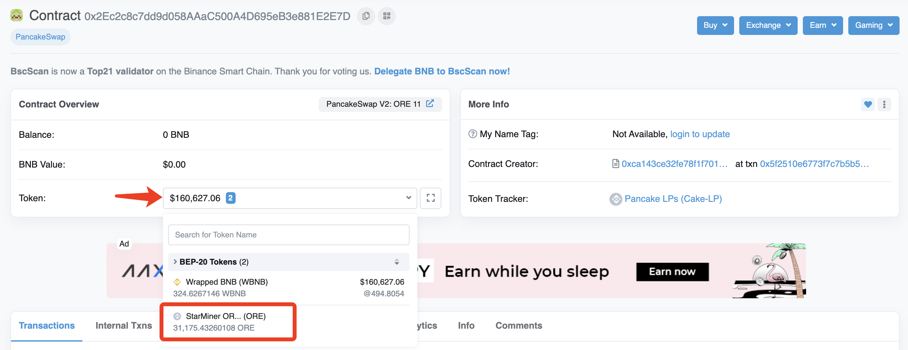

# Calculating How Many ORE To Add Liquidity

Find out​ these three variables：

* The number of LP tokens.
* The total number of LP tokens in circulation.
* The current amount  of tokens in the pool.

#### **Step 1:** Find out the amount of LP tokens you need.

#### **Step 2:** Find out the total amount of LP tokens in circulation. Look for "Total Supply" in the page that opens on [BscScan](https://bscscan.com/token/0x2ec2c8c7dd9d058aaac500a4d695eb3e881e2e7d).

#### **Step 3:** Take the amount of LP tokens you need staking found in Step 1, and divide it by the "Total Supply" in Step 2, and you get your share of the LP.

For example Rarity 1:  LP Ratio = 2.016/3,125.135577 = 0.00064509

#### Step 4: Select "Contract" to be taken to the smart contract's page to be taken to the contract's page. On the contract's page, you will see a drop down that displays all the current assets within this contract address. 

#### Step 5: Calculating How Many ORE is simply using your LP Ratio obtained in Step 3, and multiplying it by each of the assets in Step 4.

Quantity of ORE = LP Ratio∗Amount of Assets

Quantity of ORE =0.00064509\*31,175.43260108=20.1109598

