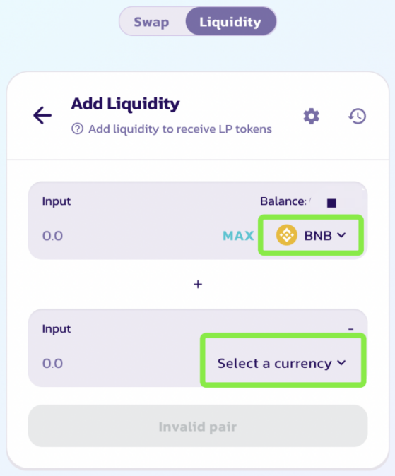

# How to Add Liquidity

Miners can speed up the recovery process by adding ORE-BNB LPs.

## **Adding liquidity**


To provide liquidity, you’ll need to commit an amount of BNB and ORE token.

### **Add BNB-ORE Liquidity:** Visit the [**BNB-ORE Liquidity page**](https://pancakeswap.finance/add/BNB/0xD50f71d0Cc64C228074332cd3c597a63556BdB67)\*\*\*\*

### Steps

1.Visit the [Liquidity page](https://pancakeswap.finance/liquidity). 


2.Click the **Add Liquidity** button.


3.For the top Input, click ‘Select a currency’ and pick **BNB**. For the bottom input, click ‘Select a currency’ and pick **ORE**.

Paste ORE address: 0xd50f71d0cc64c228074332cd3c597a63556bdb67


4.Enter an amount on one of the tokens under “Input”. The other will calculate automatically.

The **Supply** button will light up. Click it.


5.A Window will appear saying how much you will receive. Click the **Confirm Supply** button. Your wallet will ask you to confirm the action.

6.After a short wait, you will see your LP Token balance at the bottom of the page.

You can repeat the steps above to add more liquidity at any time.

## **Removing liquidity**

### **Steps**

1.Visit the [Liquidity page](https://pancakeswap.finance/liquidity)**.**

2.Click on your pair under “Your Liquidity”.

3.Click **Remove**. A new window will appear.

4.Use the buttons or slider to choose what percent to remove. Choose **MAX** to remove everything.

5.Click **Approve**. Your wallet will ask you to confirm the action**.**

6.The **Remove** button will light up. Click it.

7.A Window will appear saying what you will receive. Click **Confirm**. Your wallet will ask you to confirm the action.

8.After a short wait, you will see your new LP Token balance at the bottom of the page.

