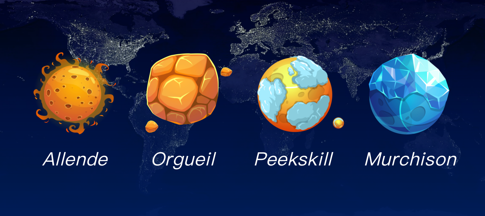

# Mineral Planets

StarMiner has 4 mineral planets: Murchison, Allende, Peekskill, Orgueil. You can choose any of them for mining. Winning rate is crucial for more rewards, you'd better pay attention to calculate it and choose the mineral planet wisely to get more rewards!

